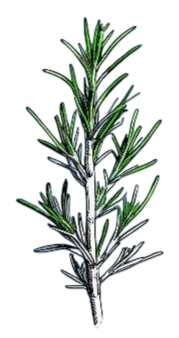
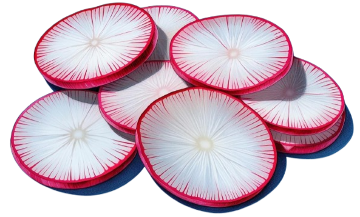
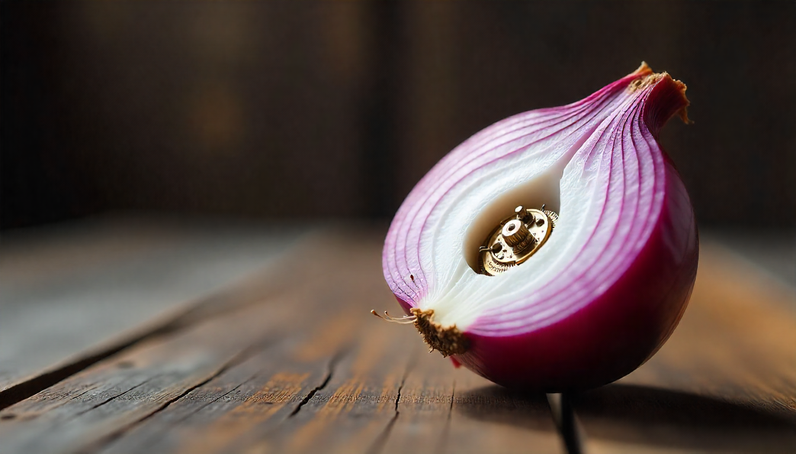
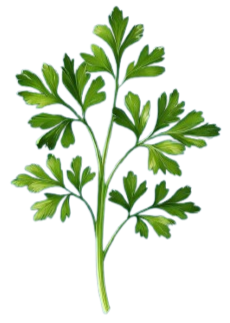
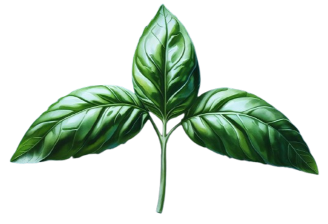
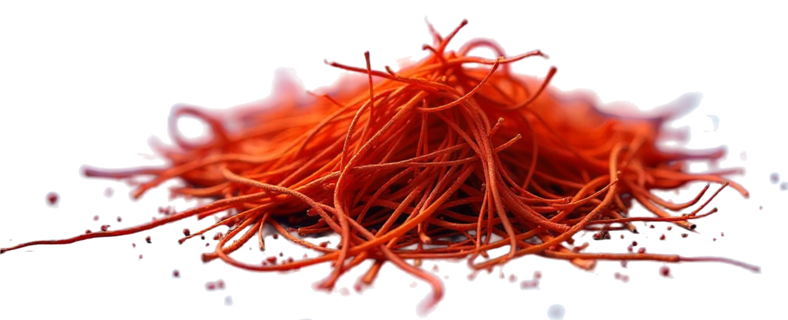
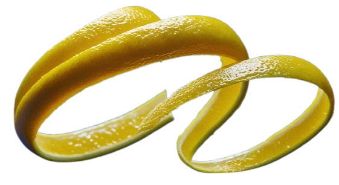
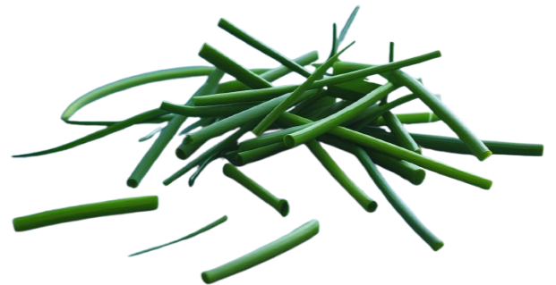

+++
title = "Garnish your widgets"
date = 2025-08-01
template = "article.html"
[extra]
menu_image = "/images/menu-ratatui-garnish"
subtitle = "Dynamic, flexible and type-safe trait composition in Rust."
summary = "This article presents a novel \"flat decorator\" pattern that addresses fundamental limitations in both traditional recursive decorators and current widget design approaches. Instead of nesting decorators within each other or embedding styling directly in widgets, the pattern stores all decorators in a single contiguous collection alongside the core component. Using enum polymorphism rather than trait objects or recursive structures, this approach achieves the composability benefits of the decorator pattern while avoiding type explosion, cache locality issues, and runtime inflexibility. The result is a type-safe, dynamic composition system that trades a small memory overhead for significant gains in code reusability, maintainability, and developer ergonomics—demonstrating how thoughtful use of Rust's type system can create more elegant solutions to common design pattern challenges."
+++

<div align="center">



*Flexible, dynamic and type-safe composition in Rust*

[skip to the code](https://github.com/franklaranja/ratatui-garnish)

</div>

Whilst writing new widgets for Ratatui, a Rust library for cooking up delicious 
TUIs (terminal user interfaces)
{{ cite(authors="Ratatui Developers", year="2023", id="ref-ratatui2023") }}
I experienced some repetitive
coding involving `Style` and `Block` which ratatui widgets typically use to configure
the colors, padding, border and title of a widget. The inclusion of `Style`
and `Block` in every widget leads not only to repetitive code but also to complexity and inflexibility.

Composition is the Rust way. But what should be
composed of what? When composing two items, say a block and a widget,
widget can contain block (as in Ratatui), block can contain widget or
a new type can be created containing both.

An additional pain point in the Ratatui API is that after setting a `Block`
you lose access to it, making it impossible to check or modify `Block` after
construction. I don't see good reasons for changing the visibility of public
items, it sure is inconvenient and not user friendly.

To scratch the itch, I wrote a library that doesn't require widgets to contain
`Style` and `Block` or even know about them. As a consequence it makes it easier
to write widgets and new ways to modify widgets: **ratatui-garnish**
{{ cite(authors="Laranja, F.", year="2025-1", id="ref-laranja2025-1") }}.
It uses a flexible,
dynamic and type-safe composition pattern for Rust. I found the result interesting
and so wrote this article about it, I hope you find it interesting too!

<div align="center">

## Widgets, Styles and Blocks

</div>

A widget in Ratatui is something that implements one of the Widget traits
`Widget`, `WidgetRef` or stateful versions of those. `Widget`'s render
method simply calls `render_ref()` and then eats your widget, how rude! So 
lets look at the implementation of `WidgetRef`. Many of Ratatui's widgets
follow this template:

```rust
pub struct WidgetFoo<'a> {
    /// A block to wrap the widget in
    block: Option<Block<'a>>,
    /// Widget style
    style: Style,
    // widget specific fields
}

impl WidgetRef for WidgetFoo<'_> {
    fn render_ref(&self, area: Rect, buf: &mut Buffer) {
        buf.set_style(area, self.style);
        self.block.render_ref(area, buf);
        let inner = self.block.inner_if_some(area);
        self.render_widget_foo(inner, buf);
    }
}
```

Of course, style and block are used in several other methods, the constructor
`new` and the setter for `Block`. `Style` got it's own trait `Styled`).
`Block` and `Style` act the same in each widget, is it necessary to repeat this
code? In addition `Block` has its own `Style`, I assume that the widget needs
it own version is because block is optional. I assume `Block` has grown, it
acquires more features as the alternative is to start change all widgets,
is it a block? What is it?

Let's analyze the rendering of a widget. `Style` and `Block` are handled first,
here is what happens:

 1. Style renders before widget renders
 2. Block renders before widget renders
 3. Block changes area before widget renders

They both run some code before the widget is rendered, and `Block` changes the
`area` parameter for the widget, but they don't change any other aspect
of the widget. The widget doesn't need them. The inclusion of both is repetitive,
leads to complexity and inflexibility.

Let's ask the question "What is composed of what?". Can we turn the composition
inside out, include widgets in `Block` (and `Style` too), the
second composition way:
  
```rust
struct Block<'a> {
   widget: Box<dyn WidgetRef>,
   /// other block fields
}

impl WidgetRef for Block<'_> {
fn render_ref(&self, area: Rect, buf: &mut Buffer) {
    buf.set_style(area, self.style);
    self.render_block(area, buf);
    let inner = self.inner_area(area);
    self.widget.render_ref(inner, buf);
    }
}
```

So `Block` becomes a wrapper of a widget and implements `Widget`, it 
modifies the input and/or the output of the contained widget. As
it is a widget it self, it suddenly is possible to add two borders
around the widget. Voila, now our widgets become like onions: 
`(Style(Block(Paragraph)))`.



O, clever me, I just reinvented the **Decorator Pattern**:

> **Decorator**
>
> *Intent*
>
> Attach additional responsibilities to an object dynamically.
> Decorators provide a flexible alternative to subclassing for
> extending functionality.
>
> Also Known As Wrapper
>
> {{ cite(authors="Gamma et al.", year="1994", id="ref-gamma1994") }}

<aside>

# Decorator pattern in Rust

In Rust the decorator pattern consists of a trait, objects
implementing the trait and wrappers (decorators) modifying
the trait. The decorators typically use either generics {{
cite( id="ref-snoek2023", authors="Snoek, I.", year="2023") }}
or trait objects {{ cite(authors="lpxxn", year="2025",
id="ref-lpxxn2025") }} and green tea , to wrap the objects.

See {{ cite(authors="Drysdale, D.", year="2024",
id="ref-drysdale2024") }} for a comparison of generics with
trait objects.

</aside>

Luckily Rust doesn't suffer from subclassing, but having a
dynamic, flexible way to extend functionality sure is nice to have and
is what we need to solve modifying widgets. Indeed the Gang of Four use
widgets as an example for the decorator pattern, and I wonder if the name comes
from this use.


The gang continues about decorators:

> Avoids feature-laden classes high up in the hierarchy. Decorator
> offers a pay-as-you-go approach to adding responsibilities.
> Instead of trying to support all foreseeable features in a complex,
> customizable class, you can define a simple class and add
> functionality incrementally with Decorator objects.
> Functionality can be composed from simple pieces.
>
>  {{ cite(authors="Gamma et al.", year="1994", id="ref-gamma1994") }}

Hey, that that complex, customizable class, that is the `Block` widget
right there! And those simple pieces! Yummie! Gimme, gimme, gimme!

<div align="center">

## Garnishing

</div>

Let's build decorators for our widgets. As they are Ratatui widgets,
we are not going to simply decorate them, we are going to *garnish* them.
I'd like to avoid implementing all the variations of the `Widget`
trait. Here is a trait to modify widgets:


```rust
/// A trait that can modify the rendering of a widget.
pub trait RenderModifier {
    /// Modifies the widget's rendering area.
    ///
    /// Returns the adjusted area, typically reduced to account for borders, padding, or shadows.
    /// Default implementation returns the input area unchanged.
    fn modify_area(&self, area: Rect) -> Rect {
        area
    }

    /// Executes before the widget is rendered.
    ///
    /// Used for pre-rendering effects like setting background styles or drawing shadows.
    /// Default implementation does nothing.
    fn before_render(&self, _area: Rect, _buf: &mut Buffer) {}

    /// Executes after the widget is rendered.
    ///
    /// Used for post-rendering effects like drawing titles over borders.
    /// Default implementation does nothing.
    fn after_render(&self, _area: Rect, _buf: &mut Buffer) {}
}
```

Basically the `RenderModifier` trait provides three ways that a garnish can
modify `render` methods. The first two come from the current use of `Style`
and `Block` in rendering widgets. The last method, `after_render`, is new.
That is not something the `Block` widget does. Can you think of a useful
Garnish that renders after the widget has been rendered?

In a way I think the use of the term 'decorator pattern' is a bit unfortunate
as it implies a certain application. What we really doing is function
composition using traits. And this is way more powerful than just decorating
a widget with a border.

<div align="center">

## Garnished Widgets

</div>

Let's look again at the composition method. We need a way to combine a 
widget with the garnish. There is a problem with this, as I mentioned above the onion
structure that we get. This recursive `struct` very much looks like a
linked list to me, with all the downsides of a linked list. Instead
of creating this onion, what about the third way, creating a new type
that wraps the widget and the garnishes? Can we create a `struct` that
both wraps the widget and a `Vec` of garnishes? We would be able to
 easily access all applied garnishes. And we would not need to implement
all variations of `Widget` for each garnish, only the relevant methods of
`RenderModifier`. Something like:

```rust
pub struct GarnishedWidget<W> {
   widget: W,
   garnish: Vec<RenderModifier>,
}
```

Wait a minute! `RenderModifier` is a trait! No `Vec` for you!

Well, we could use trait objects, but you know what happens with them: all your
garnishes start looking the same and you can't tell lemon zest from
parsley. Let's use an `enum` instead so we don't lose our garnishes...
I mean types. To avoid writing the boiler plate for the `enum` I use the
`nodyn!` macro provided by the [nodyn](/code/nodyn/) crate 
{{ cite(authors="Laranja, F.", year="2025-2", id="ref-laranja2025-2") }},
which also helps with this polymorphic `Vec` we need for our
`GarnishedWidget`:

```rust
use derive_more::{Deref, DerefMut};

nodyn::nodyn! {
    #[derive(Debug, Clone)]
    pub enum Garnish<'a> {
        Style,
        Block<'a>,
    }

    impl is_as;

    impl RenderModifier {
        fn before_render(&self, area: Rect, buf: &mut Buffer);
        fn modify_area(&self, area: Rect) -> Rect;
        fn after_render(&self, area: Rect, buf: &mut Buffer);
    }

    /// A `Vec` of `Garnish` for applying multiple garnishes to widgets.
    vec Garnishes;

    /// A widget that wraps another widget with a vector of garnishes.
    ///
    /// This struct implements `Deref` and `DerefMut` to the inner widget,
    /// allowing you to access the original widget's methods while adding
    /// garnish functionality.
    #[vec(garnishes)]
    #[derive(Debug, Deref, DerefMut)]
    pub struct GarnishedWidget<W> {
        #[deref]
        #[deref_mut]
        pub widget: W,
    }
}
```

Note: `ratatui-garnish` also has a stateful version of
`GarnishedWidget` for `StatefulWidget`.

<aside>

# Polymorphism with enums

> This is a perfectly good solution
> when our interchangeable items are a fixed set of types that we
> know when our code is compiled.
> {{ cite(authors="Klabnik et al.", year="2025", id="ref-klabnik2025") }}

Using enums has several advantages over trait objects, for example 
it prevents type erasure. It has its disadvantages too, such as
the amount of boiler plate code it requires. The nodyn crate
{{ cite(authors="Laranja, F.", year="2025", id="ref-laranja2025") }}
provides a macro that makes using enums for polymorphism easy.

</aside>

The `nodyn!` macro generates an `enum Garnish` which we use as an alternative to
trait objects, the variants are the different garnishes we have:
`Style` and `Block`. The macro generates the variant names for us, e.g.
`Style` expands to `Style(Style)`. The `impl RenderModifier` block gives
the signatures from the `RenderModifier` trait. Using this `RenderModifier`
gets implemented for `Garnish` by delegating to the variants.

The line `vec Garnishes`, creates a wrapper around
a `Vec<Garnish>` with delegated `Vec` methods and variant-specific
utilities. It supports flexible insertion via `Into<Enum>` and provides
methods like `first_*`, `count_*`, and `all_*` for variant-specific access.
A `garnishes!` macro is also generated for easy initialization.
`Garnishes` is useful for garnishing several widgets with the
same garnishes.

The `#[vec(garnishes)]` attribute instructs nodyn to turn the 
`struct` that follows into a polymorphic `Vec` by adding a field
`garnishes` with the type of `Vec<Garnish>`. I used the [derive_more](..)
crate
{{ cite(authors="Fennema, J.", year="2025", id="ref-fennema2025") }},
to derive `Deref` and `DerefMut`. The resulting `GarnishedWidget`
acts like the widget it wraps and as a `Vec` of `Garnishes` as well. Now
we can simply add garnishes by pushing them to the widget.

Although `GarnishedWidget` is called a widget, it hasn't got 
the traits dude! Let's add:

```rust
impl<'a, W: Widget + Clone> Widget for GarnishedWidget<'a, W> {
    fn render(self, area: Rect, buf: &mut Buffer) {
        let mut area = area;
        for g in &self.garnish {
            g.before_render(area, buf);
            area = g.modify_area(area);
        }
        self.inner.render(area, buf);
        for g in &self.garnish {
            g.after_render(area, buf);
        }
    }
}

impl<'a, W: WidgetRef + Clone> WidgetRef for GarnishedWidget<'a, W> {
    fn render_ref(&self, area: Rect, buf: &mut Buffer) {
        let mut area = area;
        for g in &self.garnish {
            g.before_render(area, buf);
            area = g.modify_area(area);
        }
        self.inner.render_ref(area, buf);
        for g in &self.garnish {
            g.after_render(area, buf);
        }
    }
}
```

As you can see the `after_render()`s are executed in the same order
as the `before_render()`s, which makes it bit easier to reason about than
the recursive `struct` from the basic decorator pattern. Let's finish off
our `GarnishedWidget` by giving it an constructor, and
as push doesn't sound like what a chef does to decorate a dish
lets wrap that and make it chainable:

```rust
impl<'a, W> GarnishedWidget<'a, W> {
    /// creates a new `garnishedwidget` with a single garnish.
    pub fn new<G: Into<Garnish<'a>>>(widget: W, garnish: G) -> Self {
        Self {
            widget,
            garnishes: vec![garnish.into()],
        }
    }

    /// Adds an additional garnish to the widget.
    pub fn garnish<G: Into<Garnish<'a>>>(mut self, garnish: G) -> Self {
        self.push(garnish);
        self
    }
}
```

Instead of composing `Style`, `Block` and widgets by including one within another
I created a new `struct` to combined them all: a **flat decorator**.
By using a `enum` instead of trait objects, type erasure is avoided.
This setup is a bit more complex than the basic decorator, but this
initial complexity and the leverage of traits
makes the subsequent implementation of garnishes a breeze.

## Garnishable Widgets

To make garnishing widgets even easier, I wrote an extension
traits for for the widget traits that adds a `garnish` method to
any widget. That method turns the widget in a `GarnishedWidget`
and adds a garnish.


```rust
use ratatui::{style::{Color, Style}, text::Line, widgets::Padding};
use ratatui_garnish::{GarnishableWidget, RenderModifier};

let widget = Line::raw("Hello, World!")
 .garnish(Style::default().bg(Color::Blue))   // Background for padded area
 .garnish(Padding::horizontal(1))             // Padding on left and right
 .garnish(Style::default().bg(Color::Red))    // Background for next padded area
 .garnish(Padding::vertical(2))               // Padding on top and bottom
 .garnish(Style::default().bg(Color::White)); // Background for the line
```

As you can see with `ratatui-garnish`, you can easily turn the
three blockless text widgets from Ratatui `Text`, `Line` and `Span`, into
full widgets with borders, padding & titles.

<div align="center">

## Garnishes

</div>

Now we start implementing garnishes, in the example above I used `Style` and `Block` as
variants of the `Garnishes enum`, so **ratatui-garnish** offers the same functionality
as Ratatui, we implement `Garnish` for both:

```rust
impl Garnish for Style {
    fn before_render(&self, area: Rect, buf: &mut Buffer) {
        buf.set_style(area, *self);
    }
}

impl<'a> Garnish for Block<'a> {
    fn modify_area(&self, area: Rect) -> Rect {
        self.inner(area)
    }

    fn before_render(&self, area: Rect, buf: &mut Buffer) {
        self.render_ref(area, buf);
    }
}
```

`Block` can do lots of things: it has its own `Style`, it can render a border with 
titles and add padding. I like to split this up in light weight, simpler garnishes, 
which can than easily be combined in all kind of ways. `Style`
we already have. For padding we can use the `Padding` `struct` that `Block` uses:

```rust
use ratatui::widgets::Padding;

impl Garnish for Padding {
    fn modify_area(&self, area: Rect) -> Rect {
        Rect {
            x: area.x + self.left,
            y: area.y + self.top,
            width: area.width.saturating_sub(self.left + self.right),
            height: area.height.saturating_sub(self.top + self.bottom),
        }
    }
}
```

## Available garnishes

Instead of `Block`, `ratatui-garnish` uses many simple garnishes
to provide similar functionality. As this article's focus is on
the design pattern used, I won't go over the implementation of
all garnishes, but give a summary of the garnishes included in
version 0.1.0 (more garnishes are planned). 

### Borders
- Standard: `PlainBorder`, `RoundedBorder`, `DoubleBorder`, `ThickBorder`
- Dashed variants: `DashedBorder`, `RoundedDashedBorder`, `ThickDashedBorder`, `DoubleDashedBorder`, `RoundedDoubleDashedBorder`, `ThickDoubleDashedBorder`
- Custom: `CharBorder` (single character, e.g., `****`), `CustomBorder` (fully customizable character set)
- Specialty: `QuadrantInsideBorder`, `QuadrantOutsideBorder`, `FatInsideBorder`, `FatOutsideBorder`

### Titles
- Horizontal: `Title<Top>` (over top border), `Title<Bottom>` (over bottom border), `Title<Above>` (reserves space above), `Title<Below>` (reserves space below)
- Vertical: `Title<Left>` (over left border), `Title<Right>` (over right border), `Title<Before>` (reserves space left), `Title<After>` (reserves space right)

### Shadows
- `Shadow` (light `░`, medium `▒`, dark `▓`, or full `█` shades with full-character offsets)
- `HalfShadow` (full `█` or quadrant characters with half-character offsets)

### Built-in Ratatui Support
- `Style` (background colors, text styling)
- `Padding` (spacing around the widget)

Take a look at the `title` module for a use of `after_render()` as
`Title<Top>` renders *over* the top row of the widgets `Area`.

## Garnishes

There are quite a number of garnishes! To make it easy to apply
the same set of garnishes to multiple widgets, `ratatui-garnish` has a
special `Vec<Garnish>` called `Garnishes`. As `GarnishedWidget`
also acts as a `Vec<Garnish>` you can use its `extend_from_slice`
and `extend` methods to add `Garnishes`:

```rust
use ratatui_garnish::{
 GarnishedWidget, GarnishableWidget, RenderModifier,
 title::{Title, Top},
 border::DoubleBorder, garnishes,
};
use ratatui::{text::Line, widgets::Padding};
use ratatui::style::{Color, Style, Modifier};

let garnishes = garnishes![
    Style::default().fg(Color::Blue),
    DoubleBorder::default(),
    Padding::uniform(2),
    Style::default().fg(Color::White),
];

let mut widget = GarnishedWidget::from(Line::raw("First widget"));
widget.extend_from_slice(&garnishes);

let mut other_widget = Line::raw("Other widget")
 .garnish(
    Title::<Top>::styled("Second", Style::default().fg(Color::Green))
        .margin(1));
other_widget.extend(garnishes);
```

<div align="center">

## Demo time!

</div>

Here are some examples with screenshots of what you can do with ratatui-garnish,
it.

### It's hot, give me some Shade

Examples with shadow.

<div align="center">

## Flat Decorator Pattern

</div>

The flat decorator pattern that I described here seems a useful composition
pattern for Rust. When implemented using enum polymorphism, it offers a type-safe,
flexible and dynamic solution. Being capable of more than decorating widgets,
maybe composite trait modifier is a better name for this powerful pattern. The closest
pattern that I could find in Rust is the middleware pattern used by Axum
{{ cite(authors="Tokio Developers", year="2025", id="ref-tokio2025") }},
which is based on closures.

When you find good use for this pattern I would like to hear about it!

<section role="doc-bibliography">

<div align="center">

## References

</div>

- {{ reference(
       id="ref-drysdale2024",
       authors="Drysdale, D.",
       year="2024",
       title="Effective Rust: 35 Specific Ways to Improve Your Rust Code",
       source_type="book",
       publisher="O’Reilly Media",
       note="Chapter 2. Traits" ) }}
- {{ reference(
       id="ref-fennema2025",
       authors="Fennema, J.",
       year="2025",
       title="derive_more",
       source_type="crate",
       url="https://crates.io/crates/derive_more" )}}
- {{ reference(
       id="ref-gamma1994",
       authors="Gamma, E., Helm, R., Johnson, R., & Vlissides, J.",
       year="1994",
       title="Design Patterns: Elements of Reusable Object-Oriented Software",
       source_type="book",
       publisher="Addison-Wesley", 
       note="Defines the traditional decorator pattern" ) }}
- {{ reference(
       id="ref-klabnik2025",
       authors="Klabnik, S., Nichols, C., & Krycho, C.",
       year="2025",
       title="The Rust Programming Language",
       source_type="website",
       url="http://doc.rust-lang.org/book/ch18-02-trait-objects.html",
       note="18.2 Using Trait Objects That Allow for Values of Different Types" ) }}
- {{ reference(
       id="ref-laranja2025-1",
       authors="Laranja, F.",
       year="2025-1",
       title="ratatui-garnish",
       source_type="crate",
       url="https://crates.io/crates/ratatui-garnish" )}}
- {{ reference(
       id="ref-laranja2025-2",
       authors="Laranja, F.",
       year="2025-2",
       title="nodyn",
       source_type="crate",
       url="https://crates.io/crates/nodyn" )}}
- {{ reference(
       id="ref-lpxxn2025",
       authors="lpxxn",
       year="2025",
       title="Rust Design Patterns",
       source_type="website",
       url="https://github.com/lpxxn/rust-design-pattern"
       note="Rust decorator pattern using trait objects" )}}
- {{ reference(id="ref-matthews2022", authors="Matthews, B.", year="2022", title="Code like a Pro in Rust", source_type="book", publisher="Manning", note="10.5 Struct tagging.") }}    
- {{ reference(
    id="ref-ratatui2023",
    authors="Ratatui Developers",
    year="2023",
    title="Ratatui: A Rust crate for cooking up Terminal User Interfaces",
    source_type="website",
    url="https://ratatui.rs/" )}}
- {{ reference(
       id="ref-snoek2023",
       authors="Snoek, I.",
       year="2023",
       title="The Decorator pattern: an easy way to add functionality",
       source_type="website",
       url="https://www.hackingwithrust.net/2023/06/03/the-decorator-pattern-an-easy-way-to-add-functionality/"
       note="Rust decorator pattern using generics" ) }}
- {{ reference(
       id="ref-tokio2025",
       authors="Tokio Developers",
       year="2025",
       title="axum",
       source_type="crate",
       url="https://crates.io/crates/axum" )}}
 
</section>
