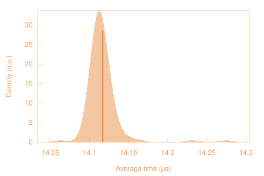
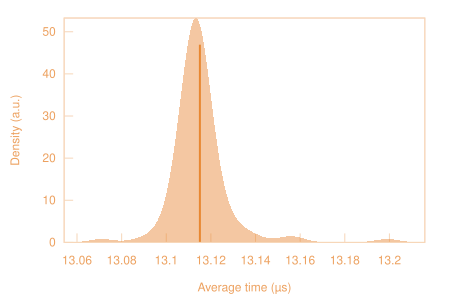
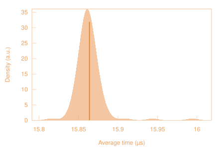

+++
title = "Garnish your widgets"
date = 2025-10-14
template = "article.html"
[extra]
subtitle = "Flexible, dynamic and type-safe composition in Rust"
summary_a = "This article presents a novel “flat decorator” pattern that addresses limitations in traditional decorators and widget designs. It achieves composability without nesting or type explosion."
summary = "This article explores composition patterns in Rust and demonstrates that composition using a wrapper which provides the combining functionality, allows for simple components to be arranged in flexible and dynamic ways."
description = "An article about composition patterns in Rust, it demonstrates that composition using a wrapper which provides the combining functionality, allows for simple components to be arranged in flexible and dynamic ways."
kw = "Rust design pattern, flat decorator, ratatui, TUI, composition, blog"
menu_image = "/images/menu-ratatui-garnish"
menu_image_alt = "Ratatouille garnished with little purple flowers and basil leaves served in a bowl with a gear shaped edge"
image = "garnish_almonds"
image_alt = "almonds arranged in a flower pattern"
section = "articles"
+++

<div class="center">
{{ picture(src="garnish_rosemary", ext="png", alt="Decorative image of Rosemary garnish", class="w20") }}

skip to [the code](https://github.com/franklaranja/ratatui-garnish) or [TL;DR](#tldr)
</div>

Whilst writing new widgets for *Ratatui*, a Rust library for cooking up delicious 
TUIs (terminal user interfaces)
{{ cite(authors="Ratatui Developers", year="2023", id="ref-ratatui2023") }}
I experienced some repetitive
coding involving `Style` and `Block` which *Ratatui* widgets typically use to configure
the colors, padding, border and title of a widget. The inclusion of `Style`
and `Block` in every widget leads not only to repetitive code but also to complexity and inflexibility.

Composition is the Rust way. But what should be
composed of what? When composing two items, say a block and a widget,
widget can contain block (as in *Ratatui*), block can contain widget or
a new type can be created containing both.

An additional pain point in the *Ratatui* API (version 0.29.0) is
that after setting a `Block` you lose access to it, making it impossible to check or modify `Block` after
construction. I don't see good reasons for changing the visibility of public
items, it's inconvenient and not user friendly.

To scratch the itch, I wrote a library that doesn't require widgets to contain
`Style` and `Block` or even know about them. As a consequence, it makes it easier
to write widgets and new ways to modify widgets: **ratatui-garnish**
{{ cite(authors="Laranja, F.", year="2025-1", id="ref-laranja2025-1") }}.
It uses a flexible,
dynamic and type-safe composition pattern for Rust. I found the result interesting
and so wrote this article about it. I hope you find it interesting too!

<div class="center">

{{ picture(src="garnish_croutons", ext="png", alt="Decorative image of croutons garnish", class="w40") }}

## Widgets, Styles and Blocks

</div>

A widget in *Ratatui* is something that implements one of the Widget traits
`Widget`, `WidgetRef` or stateful versions of those. `Widget`'s render
method simply calls `render_ref()` and then eats your widget, how rude! So 
lets look at the implementation of `WidgetRef`. Many of *Ratatui*'s widgets
follow this template:

```rust
pub struct WidgetFoo<'a> {
    /// A block to wrap the widget in
    block: Option<Block<'a>>,
    /// Widget style
    style: Style,
    // widget specific fields
}

impl WidgetRef for WidgetFoo<'_> {
    fn render_ref(&self, area: Rect, buf: &mut Buffer) {
        buf.set_style(area, self.style);
        self.block.render_ref(area, buf);
        let inner = self.block.inner_if_some(area);
        self.render_widget_foo(inner, buf);
    }
}
```

Of course, `Style` and `Block` are used in several other methods, such
as in the constructor `new` and the setter for `Block`. But
`Block` and `Style` act the same in each widget, is it necessary 
to repeat this code? In addition `Block` has its own `Style`, 
I assume that the widget needs it own version of `Style` is because `Block` 
is optional, but when `Block` is used the `Style` of a widget
can be defined in two places. I suspect `Block` has grown, it
acquires more features as the alternative is to change all the
widgets. Is it a block? What is it? 

Let's analyze the rendering of a widget. `Style` and `Block` are handled first,
they both run some code before the widget is rendered, and `Block` changes the
`area` parameter for the widget, but they don't change any other aspect
of the widget.

What happens when we turn the composition inside out, include 
widgets in `Block`, the second composition way?
  
```rust
struct Block<'a> {
   widget: Box<dyn WidgetRef>,
   // other Block fields
}

impl WidgetRef for Block<'_> {
    fn render_ref(&self, area: Rect, buf: &mut Buffer) {
        buf.set_style(area, self.style);
        self.render_block(area, buf);
        let inner = self.inner_area(area);
        self.widget.render_ref(inner, buf);
    }
}
```

So `Block` becomes a wrapper of a widget, it 
modifies the input and/or the output of the contained widget. As
it is a widget itself, it suddenly becomes possible to add two borders
around the widget. Voilà! Now our widgets become like onions: 
`(Style(Block(Paragraph)))`.

<div class="center"> 
{{ picture(src="widget_onion", ext="jpg", alt="A widget inside of an onion", class="photo w80") }}
</div>

Oh, clever me, I just reinvented the **Decorator Pattern**:

> **Decorator**
>
> *Intent*
>
> Attach additional responsibilities to an object dynamically.
> Decorators provide a flexible alternative to subclassing for
> extending functionality.
>
> Also Known As Wrapper
>
> {{ cite(authors="Gamma et al.", year="1994", id="ref-gamma1994") }}


Luckily Rust doesn't suffer from subclassing, but having a
dynamic, flexible way to extend functionality sure is nice to have and
is what we need to solve modifying widgets. Indeed the Gang of Four use
widgets as an example for the decorator pattern, and I wonder if the name comes
from this use.

The gang continues about decorators:

> Decorator offers a pay-as-you-go approach to adding responsibilities.
> Instead of trying to support all foreseeable features in a complex,
> customizable class, you can define a simple class and add
> functionality incrementally with Decorator objects.
> Functionality can be composed from simple pieces.
>
>  {{ cite(authors="Gamma et al.", year="1994", id="ref-gamma1994") }}

Hey, that complex, customizable class, that is the `Block`
widget, right there! And those simple pieces! Yummy! Gimme, gimme, gimme!

<div class="center">
{{ picture(src="garnish_parsley", ext="png", alt="Decorative image of garnish, a Parsley leaf", class="w20") }}

## Garnishing

</div>

Let's build decorators for our widgets. As they are *Ratatui* widgets,
we are not going to simply decorate them, we are going to *garnish* them.
I'd like to avoid implementing all the variations of the `Widget`
trait. Here is a trait to modify widgets:

```rust
/// A trait that can modify the rendering of a widget.
pub trait RenderModifier {
    /// Modifies the widget's rendering area.
    ///
    /// Returns the adjusted area, typically reduced to account for borders, padding, or shadows.
    /// Default implementation returns the input area unchanged.
    fn modify_area(&self, area: Rect) -> Rect {
        area
    }

    /// Executes before the widget is rendered.
    ///
    /// Used for pre-rendering effects like setting background styles or drawing shadows.
    /// Default implementation does nothing.
    fn before_render(&self, _area: Rect, _buf: &mut Buffer) {}

    /// Executes after the widget is rendered.
    ///
    /// Used for post-rendering effects like drawing titles over borders.
    /// Default implementation does nothing.
    fn after_render(&self, _area: Rect, _buf: &mut Buffer) {}
}
```

Basically the `RenderModifier` trait provides three ways that a garnish can
modify the `render` methods. The first two come from the current use of `Style`
and `Block` in rendering widgets. The last method, `after_render`, is new.
That is not something the `Block` widget does. Can you think of a useful
Garnish that renders after the widget has been rendered?

Now garnishes (decorators) are easier to write, they only have to implement one
of `RenderModifier`'s functions. These functions
are hooks that can be used to modify the `render` functions of
the `Widget` traits. So it is a way to compose traits and a bit like
composing functions in functional programming. Here is
a JavaScript function composition example:

> ```javascript
> const compose = (f, g) => x => f(g(x))
> ```
>
> The composition of two functions returns a new function. This makes
> perfect sense: composing two units of some type (in this case function)
> should yield a new unit of that very type. You don't plug two legos
> together and get a lincoln log. There is a theory here, some underlying
> law that we will discover in due time.
>
> {{ cite( id="ref-frisby2025", authors="Frisby, F.", year="2025") }}

Well, with traits this is a bit different as they exist in
combination with a struct or enum. Applying Frisby's logic,
when composing structs we should use the third way of composition: 
returning a new unit of that very type (in this case struct).

<div class="center">
{{ picture(src="garnish_flower", ext="png", alt="Decorative image of garnish, a flower", class="w20") }}

## Garnished Widgets

*One struct to rule them all,*\
*One struct to find them ...*

</div>

Hopefully the third way will solve some of the problems of the
traditional decorator pattern has that I've not mentioned. For
example their recursive nature makes accessing or modifying
the  widget and garnishes hard. You'll find a comprehensive
comparison of the patterns below.

Can we create a new type that wraps the widget and the garnishes,
instead of including one in the other?
Can we create a struct that both wraps the widget and a collection
of garnishes? With this struct we would be able to easily access
all applied garnishes. If we use a vector we would have all of its
extensive and well known methods to access and modify our garnishes.
And as this new type also combines the `Widget` traits with `RenderModifier`
we would only need to implement the relevant methods of `RenderModifier`
for each garnish. I would like something like:

```rust
pub struct GarnishedWidget<W> {
   widget: W,
   garnishes: Vec<RenderModifier>,
}
```

Wait a minute! `RenderModifier` is a trait! No `Vec` for you!

Well, we could use trait objects, but you know what happens with them: all your
garnishes start looking the same and you can't tell lemon zest from
parsley.

> In Chapter 8, we mentioned that one limitation of vectors is that they
> can store elements of only one type. We created a workaround in Listing
> 8-9 where we defined a `SpreadsheetCell` enum that had variants to hold
> integers, floats, and text. This meant we could store different types of
> data in each cell and still have a vector that represented a row of cells. 
> This is a perfectly good solution when our interchangeable items are a fixed
> set of types that we know when our code is compiled.
>
> {{ cite(authors="Klabnik et al.", year="2025", id="ref-klabnik2025") }}

Let's use an enum, so we don't lose our garnishes...
I mean types.  A disadvantage of `enums` is 
the amount of boilerplate code required. The nodyn crate
{{ cite(authors="Laranja, F.", year="2025", id="ref-laranja2025") }}
provides a macro that makes using enums for polymorphism easy,
avoids the boilerplate and it also helps with this
polymorphic vector we need for our `GarnishedWidget`:

```rust
use derive_more::{Deref, DerefMut};

nodyn::nodyn! {
    #[derive(Debug, Clone)]
    pub enum Garnish<'a> {
        Style,
        Block<'a>,
    }

    impl is_as;

    impl RenderModifier {
        fn before_render(&self, area: Rect, buf: &mut Buffer);
        fn modify_area(&self, area: Rect) -> Rect;
        fn after_render(&self, area: Rect, buf: &mut Buffer);
    }

    /// A `Vec` of `Garnish` for applying multiple garnishes to widgets.
    vec Garnishes;

    /// A widget that wraps another widget with a vector of garnishes.
    ///
    /// This struct implements `Deref` and `DerefMut` to the inner widget,
    /// allowing you to access the original widget's methods while adding
    /// garnish functionality.
    #[vec(garnishes)]
    #[derive(Debug, Deref, DerefMut)]
    pub struct GarnishedWidget<W> {
        #[deref]
        #[deref_mut]
        pub widget: W,
    }
}
```

*Note:* **ratatui-garnish** also has a stateful version of
`GarnishedWidget` for `StatefulWidget`.

The `nodyn!` macro generates an `enum Garnish` which we use as an alternative to
trait objects, the variants are the different garnishes we have:
`Style` and `Block`. The macro generates the variant names for us, e.g.
`Style` expands to `Style(Style)` and implements `From<variant>` and
`TryInto<Garnish>` for easy conversions. With the `impl as_is`
feature `nodyn` generates methods like `is_style` and
`try_as_style`.

```rust
let red_garnish: Garnish = Style::default().fg(Color::Red).into();
assert!(red_garnish.is_style());

let red_style = red_garnish.try_as_style_ref().unwrap();
assert_eq!(red_style.fg, Some(Color::Red));
```

The `impl RenderModifier` block contains the signatures from the
`RenderModifier` trait. Using this `RenderModifier` gets implemented
for `Garnish` by delegating to the variants.

The line `vec Garnishes`, creates a wrapper around
a `Vec<Garnish>` with delegated `Vec` methods and variant-specific
utilities. It supports flexible insertion via `Into<Garnish>` and provides
methods like `first_style`, `count_style`, and `all_style` for
variant-specific access. The `garnishes!` macro is also generated
for easy initialization. `Garnishes` is useful for garnishing
several widgets with the same garnishes.

The `#[vec(garnishes)]` attribute instructs `nodyn!` to turn the 
struct that follows into a polymorphic `Vec` by adding a field
`garnishes` with the type of `Vec<Garnish>`. I used the `derive_more`
crate
{{ cite(authors="Fennema, J.", year="2025", id="ref-fennema2025") }},
to derive `Deref` and `DerefMut`. The resulting `GarnishedWidget`
acts like the widget it wraps and as a `Vec` of `Garnishes` as well. Now
we can simply add garnishes by pushing them to the widget.

Although `GarnishedWidget` is called a widget, it hasn't got 
the traits bro! Let's add:

```rust
impl<'a, W: Widget + Clone> Widget for GarnishedWidget<'a, W> {
    fn render(self, area: Rect, buf: &mut Buffer) {
        let mut area = area;
        for g in &self.garnishes {
            g.before_render(area, buf);
            area = g.modify_area(area);
        }
        self.inner.render(area, buf);
        for g in &self.garnishes {
            g.after_render(area, buf);
        }
    }
}

impl<'a, W: WidgetRef + Clone> WidgetRef for GarnishedWidget<'a, W> {
    fn render_ref(&self, area: Rect, buf: &mut Buffer) {
        let mut area = area;
        for g in &self.garnishes {
            g.before_render(area, buf);
            area = g.modify_area(area);
        }
        self.inner.render_ref(area, buf);
        for g in &self.garnishes {
            g.after_render(area, buf);
        }
    }
}
```

As you can see the `after_render()`s are executed in the same order
as the `before_render()`s, which makes it bit easier to reason about than
the recursive struct from the traditional decorator pattern. Let's finish off
our `GarnishedWidget` by giving it a constructor, and
as push doesn't sound like what a chef does to decorate a dish,
lets wrap that and make it chainable:

```rust
impl<'a, W> GarnishedWidget<'a, W> {
    /// creates a new `garnishedwidget` with a single garnish.
    pub fn new<G: Into<Garnish<'a>>>(widget: W, garnish: G) -> Self {
        Self {
            widget,
            garnishes: vec![garnish.into()],
        }
    }

    /// Adds an additional garnish to the widget.
    pub fn garnish<G: Into<Garnish<'a>>>(mut self, garnish: G) -> Self {
        self.push(garnish);
        self
    }
}
```

Instead of composing `Style`, `Block` and widgets by including one within another
I created a new struct to combined them all: a **flat decorator**.
By using a enum instead of trait objects, type erasure is avoided.
This setup is a bit more complex than the traditional decorator, but this
initial complexity and the leverage of traits
makes the subsequent implementation of garnishes a breeze.

<div class="center">

{{ picture(src="garnish_cheese", ext="png", alt="Decorative image of garnish, grated cheese", class="w35") }}

## Garnishable Widgets

</div>

To make garnishing widgets even easier, I wrote an extension
traits, `GarnishableWidget` and `GarnishableStatefulWidget`,
for for the widget traits that adds a `garnish` method to
any widget. That method turns the widget in a `GarnishedWidget`
and adds a garnish.


```rust
use ratatui::{style::{Color, Style}, text::Line, widgets::Padding};
use ratatui_garnish::{GarnishableWidget, RenderModifier};

let widget = Line::raw("Hello, World!")
 .garnish(Style::default().bg(Color::Blue))   // Background for padded area
 .garnish(Padding::horizontal(1))             // Padding on left and right
 .garnish(Style::default().bg(Color::Red))    // Background for next padded area
 .garnish(Padding::vertical(2))               // Padding on top and bottom
 .garnish(Style::default().bg(Color::White)); // Background for the line
```

As you can see with **ratatui-garnish**, you can easily turn the
three text widgets from *Ratatui* that don't contain `Block`:
`Text`, `Line` and `Span`, into widgets with borders, padding & titles.

<div class="center">
{{ picture(src="garnish_basil", ext="png", alt="Decorative image of garnish, Basil leaves", class="w40") }}

## Garnishes

</div>

Now we start implementing garnishes, in the example above I used `Style` and `Block` as
variants of the `Garnish` enum, so **ratatui-garnish** offers the same functionality
as *Ratatui*, we implement `Garnish` for both:

```rust
impl Garnish for Style {
    fn before_render(&self, area: Rect, buf: &mut Buffer) {
        buf.set_style(area, *self);
    }
}

impl<'a> Garnish for Block<'a> {
    fn modify_area(&self, area: Rect) -> Rect {
        self.inner(area)
    }

    fn before_render(&self, area: Rect, buf: &mut Buffer) {
        self.render_ref(area, buf);
    }
}
```

`Block` can do lots of things: it has its own `Style`, it can render a border with 
titles and add padding. I like to split this up in lightweight, simpler garnishes, 
which can than easily be combined in all kind of ways. `Style`
we already have. For padding we can use the `Padding` struct that `Block` uses:

```rust
use ratatui::widgets::Padding;

impl Garnish for Padding {
    fn modify_area(&self, area: Rect) -> Rect {
        Rect {
            x: area.x + self.left,
            y: area.y + self.top,
            width: area.width.saturating_sub(self.left + self.right),
            height: area.height.saturating_sub(self.top + self.bottom),
        }
    }
}
```

*Note:* **ratatui-garnish** uses its own `Padding` which is the same as *Ratatui*'s 
but can be serialized and deserialized using `default`.

<div class="center">
{{ picture(src="garnish_jullien1", ext="png", alt="Decorative image of garnish, vegetable jullien", class="w40") }}

## Available garnishes

</div>

Instead of `Block`, **ratatui-garnish** uses many simple garnishes
to provide similar functionality. As this article's focus is on
the design pattern used, I won't go over the implementation of
all garnishes, but give a summary of the garnishes included in
version 0.1.0 (more garnishes are planned).

### Borders
- Standard: `PlainBorder`, `RoundedBorder`, `DoubleBorder`, `ThickBorder`
- Dashed variants: `DashedBorder`, `RoundedDashedBorder`, `ThickDashedBorder`,
- Custom: `CharBorder` (single character, e.g., `****`), `CustomBorder` (fully customizable character set)
- Specialty: `QuadrantInsideBorder`, `QuadrantOutsideBorder`, `FatInsideBorder`, `FatOutsideBorder`

### Titles
- Horizontal: `Title<Top>` (over top border), `Title<Bottom>` (over bottom border), `Title<Above>` (reserves space above), `Title<Below>` (reserves space below)
- Vertical: `Title<Left>` (over left border), `Title<Right>` (over right border), `Title<Before>` (reserves space left), `Title<After>` (reserves space right)

### Shadows
- `Shadow` (light `░`, medium `▒`, dark `▓`, or full `█` shades with full-character offsets)
- `HalfShadow` (full `█` or quadrant characters with half-character offsets)

### Padding
- `Padding` (spacing around the widget)

### Built-in *Ratatui* Support
- `Style` (background colors, text styling)

Have a look at the
source of **ratatui-garnish** to look at how easy it is to
implement a garnish, implement one or more of the methods from
`RenderModifier`, that's all! And if you wondered about a use of `after_render`,
have a look at the `Title<Top>` garnish from the title module, it renders
*over* the top row of the widget's area.

<div class="center">
{{ picture(src="garnish_mint", ext="png", alt="Decorative image of garnish, Mint leaves", class="w35") }}

## Garnishes collection

</div>

There are quite a number of garnishes! To make it easy to apply
the same set of garnishes to multiple widgets, **ratatui-garnish** has a
special `Vec<Garnish>` called `Garnishes`. As `GarnishedWidget`
also acts as a `Vec<Garnish>` you can use its `extend_from_slice`
and `extend` methods to add `Garnishes`:

```rust
use ratatui_garnish::{
 GarnishedWidget, GarnishableWidget, RenderModifier,
 title::{Title, Top},
 border::DoubleBorder, garnishes,
};
use ratatui::{text::Line, widgets::Padding};
use ratatui::style::{Color, Style, Modifier};

let garnishes = garnishes![
    Style::default().fg(Color::Blue),
    DoubleBorder::default(),
    Padding::uniform(2),
    Style::default().fg(Color::White),
];

let mut widget = GarnishedWidget::from(Line::raw("First widget"));
widget.extend_from_slice(&garnishes);

let mut other_widget = Line::raw("Other widget")
 .garnish(
    Title::<Top>::styled("Second", Style::default().fg(Color::Green))
        .margin(1));
other_widget.extend(garnishes);
```

I've added similar methods to `GarnisableWidget` for even simpler
construction of `GarnishedWidget`s:

```rust
let widget = Line::raw("First widget")
    .garnishes(garnishes![
        Style::default().fg(Color::Blue),
        DoubleBorder::default(),
        Padding::uniform(2),
        Style::default().fg(Color::White),
    ]);

// create another widget with the same garnishes
let other_widget = Line::raw("Other widget")
    .garnishes_from_slice(widget.as_slice());
```

All garnishes and `Garnishes` can implement `Serialize` and
`Deserialize` from serde
{{ cite(authors="Tryzelaar & Tolnay", year="2025", id="ref-tryzelaar2025") }}
(enable the serde feature in your Cargo.toml). This makes it easy to
implement theme support for your TUI applications!

<div class="center">
{{ picture(src="garnish_roquefort", ext="png", alt="Decorative image of garnish, crumbled Roquefort", class="w45") }}

## Recipes

</div>

Here are some examples with screenshots of what you can do with **ratatui-garnish**.
I only show the garnishes used, the complete code can
be found in the examples directory in the github repo.

### Padding

This example shows a combination of `Style` and `Padding`
garnishes on a `ratatui::text::Line` widget.

<div class="center">
{{ picture(src="padding", ext="jpg", alt="Screenshot of padding example", class="w80") }}
</div>

```rust
garnishes![
    Style::default().bg(ORANGE400),
    Padding::vertical(1),
    Style::default().bg(ORANGE600),
    Padding::horizontal(2),
    Style::default().bg(BLUE100),
    Padding::left(2),
    Style::default().bg(BLUE200),
    Padding::top(1),
    Style::default().bg(BLUE300),
    Padding::right(2),
    Style::default().bg(BLUE400),
    Padding::bottom(1),
    Style::default().bg(BLUE500),
    Padding::left(2),
    Style::default().bg(BLUE600),
    Padding::top(1),
    Style::default().bg(BLUE700),
    Padding::right(2),
    Style::default().bg(BLUE800),
    Padding::bottom(1),
    Style::default().bg(BLUE900),
    Padding::top(1),

```

### Borders

You can add any combination of borders to a widget, in this
example it is again a `ratatui::text::Line`.

<div class="center">
{{ picture(src="borders", ext="jpg", alt="Screenshot of borders example", class="w80") }}
</div>

```rust
garnishes![
    Style::default().fg(Color::Rgb(220, 0, 0)),
    CustomBorder::new(BorderSet::dashed().corners('♥')),
    Padding::proportional(1),
    CharBorder::new('♥').borders(Borders::TOP | Borders::BOTTOM),
    Padding::horizontal(1),
    Style::default().fg(GREEN700),
    PlainBorder::default(),
    Padding::horizontal(1),
    Style::default().fg(GREEN600),
    PlainBorder::default(),
    Padding::horizontal(1),
    Style::default().fg(GREEN500),
    PlainBorder::default(),
    Padding::top(1),
];
```

### Titles

This example shows the title garnishes, notice the difference
between titles that reserve space (the triangles) and those
that render over the border.

<div class="center">
{{ picture(src="titles", ext="jpg", alt="Screenshot of titles example", class="w80") }}
</div>

```rust
garnishes![
    Title::<Above>::styled("▲", Style::default().fg(ORANGE500)).centered(),
    Title::<Below>::styled("▼", Style::default().fg(BLUE500)).centered(),
    Title::<Before>::styled("◀", Style::default().fg(PURPLE500)).centered(),
    Title::<After>::styled("▶", Style::default().fg(GREEN500)).centered(),
    Padding::horizontal(1),
    Title::<Top>::styled(" top ", Style::default().fg(ORANGE200)).centered(),
    Title::<Bottom>::styled(" bottom ", Style::default().fg(BLUE200)).centered(),
    Title::<Left>::styled(" left ", Style::default().fg(PURPLE200)).centered(),
    Title::<Right>::styled(" right ", Style::default().fg(GREEN200)).centered(),
    RoundedBorder::default(),
    Padding::top(4),
];
```

### Shadow

Here we add a `Title::<Above>` and a `HalfShadow` to a
`ratatui::widgets::Paragraph` widget.

<div class="center">
{{ picture(src="shadow", ext="jpg", alt="Screenshot of shadow example", class="w80") }}
</div>

```rust
garnishes![
    Style::default().fg(BLUE600),
    HalfShadow::default(),
    Title::<Above>::styled(
        "From \"The Rust Programming Language\"",
        Style::default().bg(ORANGE400).fg(BLUE900)
    ).centered(),
    Style::default().bg(ORANGE100).fg(ORANGE700),
    Padding::proportional(2),
];
```

<div class="center">
{{ picture(src="garnish_veggies1", ext="png", alt="Decorative image of garnish, cubed vegtables arranged in a circle", class="w35") }}

## Desigining components for flexible composition

</div>

Separating functionality into simple components, just like
with functions, makes it composition easier and flexible.
For the flat decorator I separated the composition functionality
from both the widgets (The *Ratatui* way) and the garnishes
(Traditional decorators) into a new type `GarnishedWidget`,
simplifying both.

For the next section which compares the different composition
patterns, I wanted to run some benchmarks but I didn't want
to write traditional decorators. Instead I wrote a new type that
mimics traditional decorators but uses garnishes:

```rust
#[derive(Debug, Deref, DerefMut)]
pub struct DecoratedWidget<W, G> {
    #[deref]
    #[deref_mut]
    pub widget: W,
    pub garnish: G,
}
```

It implements `Widget` and has a function `decorate` that wraps
itself into a new `DecoratedWidget` with the garnish provided.
The `GarnishableWidget` widget extension trait also provides
a decorate function.

```rust
use ratatui::{style::{Color, Style}, text::Text}};
use ratatui_garnish::{
    border::PlainBorder,
    title::{Title, Top},
    GarnishableWidget, Padding,
};

let benchmark_widget = Text::raw("Hello World!")
    .decorate(Style::default().fg(Color::Red).bg(Color::White))
    .decorate(Title::<Top>::raw("Paragraph").margin(1))
    .decorate(PlainBorder::default())
    .decorate(Padding::horizontal(2));
```

Flexibility is great! Now I can run some benchmarks that only
compare the two composition patterns as the widgets and
garnishes are exactly the same. It's also easier to improve the
ergonomics of this pattern as functions only need to be added to
`DecoratedWidget` and not to every decorator.

<div class="center">
{{ picture(src="garnish_almonds", ext="png", alt="Decorative image of garnish, Almonds", class="w35") }}

## Composition patterns compared

</div>

In this article we looked at three ways of composing types in
Rust: the *Ratatui* way of including decorators (`Style` and
`Block`) directly in widgets, the traditional decorator pattern
which includes widgets in decorators, and the flat decorator
which combines a widget with decorators in a new type. 

The description of each approach includes
an example diagram of the type based on the *Ratatui* `Paragraph` widget, as the
decorator patterns don't need to include `Style` and `Block` the
examples use an imaginary type `WrappedText` with `Style` and
`Block` removed. To simplify the diagrams the field types `Option`
and `Vec` do not include these structs but their
contained types. These fields are
indicated with the type in parenthesis after the field name and a colored bar
in front of the field. Generics and trait objects, which are
similarly marked¸ have concrete types. Primitives are
dark orange, structs are blue, enums green and tuples purple.

I have included benchmark statistics for each approach created
with criterion {{ cite(authors="Apericio & Heisler", year="2025", id="ref-apericio2025") }}
running on a Kirin 710 using Rust 1.90 stable. The decorator patterns used a
`Text` widget with similar decorators
as used to construct the `Paragraph` widget for the *Ratatui* way
benchmark. The benchmark is for creating the widget with garnish
and rendering to a *Ratatui* `Buffer`. You can find the benchmark
code in the benches directory of the **ratatui-garnish** repo,
including a benchmark comparing the traditional and 
flat decorators with varying garnishes which results I've not
included.

### The **Ratatui** way

<div class="columns">
<div class="column">
<div class="struct diagram">
    <div class="struct-name">Paragraph</div>
    <ul class="fields">
        <li class="option-field">
            <div class="field-name">block</div>
            <div class="struct">
                <div class="struct-name">Block</div>
                <ul class="fields">
                    <li class="vec-field">
                        <div class="field-name">titles</div>
                        <ul class="tuple">
                            <li class="option-field">
                                <div class="struct">
                                    <div class="struct-name">Position</div>
                                </div>
                            </li>
                            <li>
                                <div class="struct">
                                    <div class="struct-name">Line</div>
                                </div>
                            </li>
                        </ul>
                    </li>
                    <li>
                        <div class="field-name">titles_style</div>
                        <div class="struct">
                            <div class="struct-name">Style</div>
                        </div>
                    </li>
                    <li>
                        <div class="field-name">titles_alignment</div>
                        <div class="struct">
                            <div class="struct-name">Alignment</div>
                        </div>
                    </li>
                    <li>
                        <div class="field-name">titles_position</div>
                        <div class="struct">
                            <div class="struct-name">Position</div>
                        </div>
                    </li>
                    <li>
                        <div class="field-name">borders</div>
                        <div class="struct">
                            <div class="struct-name">Borders</div>
                        </div>
                    </li>
                    <li>
                        <div class="field-name">border_style</div>
                        <div class="struct">
                            <div class="struct-name">Style</div>
                        </div>
                    </li>
                    <li>
                        <div class="field-name">border_set</div>
                        <div class="struct">
                            <div class="struct-name">border::Set</div>
                        </div>
                    </li>
                    <li>
                        <div class="field-name">style</div>
                        <div class="struct">
                            <div class="struct-name">Style</div>
                        </div>
                    </li>
                    <li>
                        <div class="field-name">padding</div>
                        <div class="struct">
                            <div class="struct-name">Padding</div>
                        </div>
                    </li>
                </ul>
            </div>
        </li>
        <li>
            <div class="field-name">style</div>
            <div class="struct">
                <div class="struct-name">Style</div>
            </div>
        </li>
        <li class="option-field">
            <div class="field-name">wrap</div>
            <div class="struct">
                <div class="struct-name">Wrap<div>
            </div>
        </li>
        <li>
            <div class="field-name">text</div>
            <div class="struct">
                <div class="struct-name">Text</div>
            </div>
        </li>
        <li>
            <div class="field-name">scroll</div>
            <div class="struct">
                <div class="struct-name">Scroll</div>
            </div>
        </li>
        <li>
            <div class="field-name">alignment</div>
            <div class="struct">
                <div class="struct-name">Alignment</div>
            </div>
        </li>
    </ul>
</div></div>

<div class="column">

*Ratatui* widgets embed an optional `Block` and a `Style` to handle
borders, padding, titles, and styling. As these concrete types are included
directly this approach is performant and type safe. However, this approach
leads to to repetitive code, increased complexity (have a look at
the code of the *Ratatui* `block` module), and poor maintainability, as adding
new decorations requires modifying every widget or changing
`Block`. It is also inflexible, decorations like borders and
padding are rendered in a fixed sequence. The poor developer ergonomics
are made worse by making `Block` private within widgets. Support
for functionality like scrolling and other widget interactions
is hard to do this way, and support for this in *Ratatui* is
minimal or non-existent.

#### Benchmark Statistics



<table>
    <thead>
        <tr>
            <th></th>
            <th title="0.95 confidence level" class="ci-bound">Lower bound</th>
            <th>Estimate</th>
            <th title="0.95 confidence level" class="ci-bound">Upper bound</th>
        </tr>
    </thead>
    <tbody>
        <tr>
            <td>Slope</td>
            <td class="ci-bound">14.112 µs</td>
            <td>14.114 µs</td>
            <td class="ci-bound">14.116 µs</td>
        </tr>
        <tr>
            <td>R&#xb2;</td>
            <td class="ci-bound">0.9999534</td>
            <td>0.9999555</td>
            <td class="ci-bound">0.9999528</td>
        </tr>
        <tr>
            <td>Mean</td>
            <td class="ci-bound">14.113 µs</td>
            <td>14.117 µs</td>
            <td class="ci-bound">14.122 µs</td>
        </tr>
        <tr>
            <td title="Standard Deviation">Std. Dev.</td>
            <td class="ci-bound">9.8292 ns</td>
            <td>22.885 ns</td>
            <td class="ci-bound">33.877 ns</td>
        </tr>
        <tr>
            <td>Median</td>
            <td class="ci-bound">14.111 µs</td>
            <td>14.113 µs</td>
            <td class="ci-bound">14.114 µs</td>
        </tr>
        <tr>
            <td title="Median Absolute Deviation">MAD</td>
            <td class="ci-bound">5.3554 ns</td>
            <td>8.2944 ns</td>
            <td class="ci-bound">10.455 ns</td>
        </tr>
    </tbody>
</table>

</div>
</div>

### Traditional Decorator

<div class="columns">
<div class="column">
<div class="struct diagram">
    <div class="struct-name">Style</div>
    <ul class="fields">
        <li><div class="field-name">style fields...</div></li>
        <li class="option-field">
            <div class="field-name">fg</div>
            <div class="struct">
                <div class="struct-name">Color</div>
            </div>
        </li>
        <li class="option-field">
            <div class="field-name">bg</div>
            <div class="struct">
                <div class="struct-name">Color</div>
            </div>
        </li>
        <li class="option-field">
            <div class="field-name">underline_color</div>
            <div class="struct">
                <div class="struct-name">Color</div>
            </div>
        </li>
        <li><div class="field-name">add_modifier</div>
        <div class="struct">
            <div class="struct-name">Modifier</div>
        </div></li>
        <li><div class="field-name">sub_modifier</div>
        <div class="struct">
            <div class="struct-name">Modifier</div>
        </div></li>
        <li class="trait-object-field">
                        <div class="field-name">widget</div>
                        <div class="struct">
                            <div class="struct-name">Padding</div>
                            <ul class="fields">
                                <li>
                                    <div class="field-name">left</div>
                                    <div class="primitive">
                                        <div class="primitive-name">u16</div>
                                    </div>
                                </li><li>
                                    <div class="field-name">right</div>
                                    <div class="primitive">
                                        <div class="primitive-name">u16</div>
                                    </div>
                                </li><li>
                                    <div class="field-name">top</div>
                                    <div class="primitive">
                                        <div class="primitive-name">u16</div>
                                    </div>
                                </li><li>
                                    <div class="field-name">bottom</div>
                                    <div class="primitive">
                                        <div class="primitive-name">u16</div>
                                    </div></li>
                                <li class="trait-object-field">
                                    <div class="field-name">widget</div>
                                    <div class="struct">
                                        <div class="struct-name">WrappedText</div>
                                        <ul class="fields">
                                            <li class="option-field">
                                                <div class="field-name">wrap</div>
                                                <div class="struct">
                                                    <div class="struct-name">Wrap<div>
                                                </div>
                                            </li>
                                            <li>
                                                <div class="field-name">text</div>
                                                <div class="struct">
                                                    <div class="struct-name">Text</div>
                                                </div>
                                            </li>
                                            <li>
                                                <div class="field-name">scroll</div>
                                                <div class="struct">
                                                    <div class="struct-name">Scroll</div>
                                                </div>
                                            </li>
                                            <li>
                                                <div class="field-name">alignment</div>
                                                <div class="struct">
                                                    <div class="struct-name">Alignment</div>
                                                </div>
                                            </li>
                                        </ul>
                                    </div>
                                </li>
                            </ul>
                        </div>
        </li>
    </ul>
</div>
</div>
<div class="column">

In Rust the decorator pattern consists of a trait, objects
implementing the trait and wrappers (decorators) modifying
the trait. The decorators typically use either generics {{
cite( id="ref-snoek2023", authors="Snoek, I.", year="2023") }}
or trait objects {{ cite(authors="lpxxn", year="2025",
id="ref-lpxxn2025") }} and {{ cite(authors="Green Tea Coding", year="2025", id="ref-greentea2025") }},
to wrap the objects. The diagram shows an example using trait
objects, the diagram for decorators using generics would lead
to a similar recursive pattern.

Depending on the number of decorators and widgets used, generics
can lead to an explosion of structs, increased compile times and
bigger code. With trait objects however you get type erasure,
and a heap allocation for each widget or decorator. For a more
comprehensive comparison see {{ cite(authors="Drysdale, D.", year="2024",
id="ref-drysdale2024") }},  {{ cite(authors="Gjengset, J.", year="2022",
id="ref-gjengset2022") }} and {{ cite(authors="Blandy et al", year="2021",
id="ref-blandy2021") }}.

The performance of decorators using generics would be better than
those using trait objects.
Maintainability is better than the *Ratatui* way, although
in the case of *Ratatui* decorators you need to create a version for regular and
stateful widgets, with each needing two traits (`Widget` and
`WidgetRef`). Flexibility is also better as decorators can be
added in any number and order desired. The developer ergonomics
are mixed. Accessing or modifying inner decorators
or the widget is cumbersome due to the recursive chain, and when using trait
objects for wrapping even worse due to type erasure. 
When using generics type signature becomes unwieldy, e.g.
`Style<PlainBorder<Padding<Paragraph>>>`. 

In the previous section I described alternative approach for
implementing traditional decorators in Rust using generics
for the decorator part too. I used that to generate the
benchmarks. It also simplifies implementing decorators. 

#### Benchmark Statistics



<table>
    <thead>
        <tr>
            <th></th>
            <th title="0.95 confidence level" class="ci-bound">Lower bound</th>
            <th>Estimate</th>
            <th title="0.95 confidence level" class="ci-bound">Upper bound</th>
        </tr>
    </thead>
    <tbody>
        <tr>
            <td>Slope</td>
            <td class="ci-bound">13.112 µs</td>
            <td>13.113 µs</td>
            <td class="ci-bound">13.114 µs</td>
        </tr>
        <tr>
            <td>R&#xb2;</td>
            <td class="ci-bound">0.9999858</td>
            <td>0.9999865</td>
            <td class="ci-bound">0.9999858</td>
        </tr>
        <tr>
            <td>Mean</td>
            <td class="ci-bound">13.113 µs</td>
            <td>13.115 µs</td>
            <td class="ci-bound">13.118 µs</td>
        </tr>
        <tr>
            <td title="Standard Deviation">Std. Dev.</td>
            <td class="ci-bound">7.7846 ns</td>
            <td>13.318 ns</td>
            <td class="ci-bound">18.658 ns</td>
        </tr>
        <tr>
            <td>Median</td>
            <td class="ci-bound">13.112 µs</td>
            <td>13.114 µs</td>
            <td class="ci-bound">13.115 µs</td>
        </tr>
        <tr>
            <td title="Median Absolute Deviation">MAD</td>
            <td class="ci-bound">3.6286 ns</td>
            <td>6.0591 ns</td>
            <td class="ci-bound">7.2340 ns</td>
        </tr>
    </tbody>
</table>


</div></div>

### Flat Decorator

<div class="columns">
<div class="column">
<div class="struct diagram">
    <div class="struct-name">GarnishedWidget</div>
    <ul class="fields">
        <li class="generic-field">
            <div class="field-name">widget</div>
            <div class="struct">
                <div class="struct-name">WrappedText</div>
                <ul class="fields">
                    <li class="option-field">
                        <div class="field-name">wrap</div>
                        <div class="struct">
                            <div class="struct-name">Wrap<div>
                        </div>
                    </li>
                    <li>
                        <div class="field-name">text</div>
                        <div class="struct">
                            <div class="struct-name">Text</div>
                        </div>
                    </li>
                    <li>
                        <div class="field-name">scroll</div>
                        <div class="struct">
                            <div class="struct-name">Scroll</div>
                        </div>
                    </li>
                    <li>
                        <div class="field-name">alignment</div>
                        <div class="struct">
                            <div class="struct-name">Alignment</div>
                        </div>
                    </li>
                </ul>
            </div>
        </li>
        <li class="vec-field">
            <div class="field-name">garnishes</div>
            <div class="enum">
                <div class="enum-name">Garnish</div>
                <ul class="variants">
                    <li>
                        <div class="variant-name">Style</div>
                        <div class="struct">
                            <div class="struct-name">Style</div>
                        </div>
                    </li>
                    <li>
                        <div class="variant-name">Padding</div>
                        <div class="struct">
                            <div class="struct-name">Padding</div>
                        </div>
                    </li>
                    <li>
                        <div class="variant-name">PlainBorder</div>
                        <div class="struct">
                            <div class="struct-name">PlainBorder</div>
                        </div>
                    </li>
                    <li>
                        <div class="variant-name">TitleAbove</div>
                        <div class="struct">
                            <div class="struct-name">Title&lt;'a, Above&gt;</div>
                        </div>
                    </li>
                    <li>
                        <div class="variant-name">other variants...</div>
                    </li>
                </ul>
            </div>
        </li>
    </ul>
</div>
</div>
<div class="column">

In this article I introduced the flat decorator pattern that
I used to write the **ratatui-garnish** crate. This pattern
composes widgets and decorators by wrapping them in a new type
(`GarnishedWidget` and `GarnishedStatefulWidget`). The decorators
have their own trait (`RenderModifier`) which gets combined width
the `Widget` and friends traits in `GarnishedWidget`. All
decorators are contained within a single `Vec` using enum
polymorphism. The enum adds a bit of memory overhead and extra
logic (variant matching), it is generated using the nodyn macro
which increases compilation time. But the `Vec` provides a familiar and
easy API to manipulate the decorators. The `garnishes!` macro and 
`GarnishableWidget` trait offer a fluent API, enhancing developer
ergonomics even more. Maintainability is much improved, both for
widgets (just like the traditional decorators) but the decorators
as well as they don't need to wrap a widget and only need to
implement `RenderModifier`. Maintaining the new type
(`GarnishedWidget`) is easy thanks to the `nodyn!` macro.

#### Benchmark Statistics



<table>
    <thead>
        <tr>
            <th></th>
            <th title="0.95 confidence level" class="ci-bound">Lower bound</th>
            <th>Estimate</th>
            <th title="0.95 confidence level" class="ci-bound">Upper bound</th>
        </tr>
    </thead>
    <tbody>
        <tr>
            <td>Slope</td>
            <td class="ci-bound">15.860 µs</td>
            <td>15.861 µs</td>
            <td class="ci-bound">15.863 µs</td>
        </tr>
        <tr>
            <td>R&#xb2;</td>
            <td class="ci-bound">0.9999660</td>
            <td>0.9999678</td>
            <td class="ci-bound">0.9999658</td>
        </tr>
        <tr>
            <td>Mean</td>
            <td class="ci-bound">15.861 µs</td>
            <td>15.864 µs</td>
            <td class="ci-bound">15.868 µs</td>
        </tr>
        <tr>
            <td title="Standard Deviation">Std. Dev.</td>
            <td class="ci-bound">9.6348 ns</td>
            <td>19.040 ns</td>
            <td class="ci-bound">27.841 ns</td>
        </tr>
        <tr>
            <td>Median</td>
            <td class="ci-bound">15.860 µs</td>
            <td>15.862 µs</td>
            <td class="ci-bound">15.863 µs</td>
        </tr>
        <tr>
            <td title="Median Absolute Deviation">MAD</td>
            <td class="ci-bound">6.5498 ns</td>
            <td>8.4261 ns</td>
            <td class="ci-bound">10.747 ns</td>
        </tr>
    </tbody>
</table>

</div></div>

### Performance Analysis   

The benchmark results show statistically significant performance differences
(non-overlapping 95% confidence intervals) between all three approaches.
The traditional decorator is fastest (13.11 µs), followed by the Ratatui                                  approach (14.11 µs, 7.6% slower), with the flat decorator being slowest
(15.86 µs, 20.9% slower than traditional). However, these microsecond
differences are negligible for typical TUI applications. The flat decorator's
slight performance overhead is a reasonable trade-off for its superior
flexibility, maintainability, and ergonomics.

<div class="center">
{{ picture(src="garnish_lemon", ext="png", alt="Decorative image of garnish, curl of lemon rind", class="w45") }}

## Flat Decorator Pattern

*Separation of Concerns Simplifies Everything*

</div>

The **ratatui-garnish** library introduces a flat decorator pattern
that transforms widget modification in *Ratatui*, offering a
type-safe, flexible, and efficient alternative to the traditional
*Ratatui* approach and recursive decorator patterns.

The pattern resulted from creating
a new type to handle the composition. The components in
**ratatui-garnish**, widgets, decorators and composers, have clear
roles and handle only what they need to. This results in simpler code
which is easier to understand, improving maintainability and
facilitates development of new components. The result offers
additional benefits: flexibility and great ergonomics.
The dynamic nature of this solution can improve many UX features
of TUI applications.

When I am writing a library it is often hard to image all different
usage scenarios, and which composition pattern has the
best trade-offs. Splicing the composition functionality into a
new type makes it easy to cater to different needs.
**Ratatui-garnish** offers the flat decorator `GarnishedWidget`
for complex and dynamic TUIs and a traditional decorator
`DecoratedWidget` for when you want a simple TUI, optimized for
speed.

From scratching an itch and simplifying code I came to powerful
tool to streamline widget development and unlock creative 
possibilities. Developing new effects, garnishes, is simplified thanks to the
`RenderModifier` trait. **Ratatui-garnish**'s fluent API,
exemplified by the `garnishes!` macro and `GarnishableWidget` trait,
makes it easy to experiment with complex effects, such as combining
multiple borders, titles, and shadows, as shown in the recipes
section. The use of enum polymorphism via the `nodyn!` macro
ensures compile-time type safety, while the contiguous `Vec`
structure simplifies modifications,
addressing the limitations of embedded `Style` and `Block` fields
or recursive structures. This pattern not only reduces boilerplate
but also empowers developers to create visually rich TUIs with
minimal effort.

Beyond TUIs, the flat decorator pattern might be useful in other
situations that benefit from flexible, dynamic and type-safe
composition. For situations where it is not suitable
the principle of creating a new type to handle the composition
might still apply. I would love to hear about such patterns and
new garnishes of course, [get in touch](/contact)!

<div class="center" id="tldr">

{{ picture(src="garnish_pinenuts", ext="png", alt="Decorative image of pinenuts", class="w40") }}

## TL;DR

</div>


**Problem:** Ratatui widgets embed `Style` and `Block` directly, leading
to repetitive boilerplate, complexity, and inflexibility. You can't
easily add margins outside borders, stack multiple decorations, or
modify decorations after construction.

**Solution:** The **flat decorator pattern** - a new type (`GarnishedWidget`)
that wraps both the widget and a `Vec` of decorators (called "garnishes").
Instead of nesting decorators recursively or embedding them in widgets,
everything lives in a flat structure.

## Key Takeaways

### 1. Separation of Concerns Simplifies Everything
- **Widgets**: Just render content, no decoration logic
- **Garnishes**: Just implement `RenderModifier`
- **Composer** (`GarnishedWidget`): Handles the orchestration
- Result: Less code, easier maintenance, clearer responsibilities

### 2. Practical Benefits

```rust
// Easy composition in any order
let widget = Text::raw("Hello")
    .garnish(Padding::uniform(2))        // margin
    .garnish(Style::default().bg(Blue))  // outer background
    .garnish(RoundedBorder::default())   // border
    .garnish(Padding::horizontal(1))     // inner padding
    .garnish(Style::default().bg(White)); // inner background

// Access and modify garnishes like a Vec
assert_eq!(widget.count_padding(), 2);
widget.remove(0); // Remove first padding
widget.push(Shadow::default()); // Add shadow

// Reuse garnishes across widgets
let theme = garnishes![Style::default().fg(Blue), DoubleBorder::default()];
widget1.extend_from_slice(&theme);
widget2.extend(theme);
```

### 3. Broader Applications

The flat decorator pattern isn't specific to TUIs - it's useful anywhere you need:

- Flexible, dynamic composition
- Easy access to all composed elements
- Runtime modification of behavior

## What You Can Build

With **ratatui-garnish** you can easily create:

- **Themed UIs** - Serialize/deserialize garnish sets (serde support)
- **Dynamic layouts** - Add/remove decorations at runtime based on state
- **Rich widgets** - Multiple borders, shadows, nested padding, positioned titles
- **Reusable components** - Share garnish collections across widgets
- **Clean custom widgets** - No boilerplate for borders/padding/styling

## The Bottom Line

By extracting composition logic into a new type and using enum
polymorphism instead of trait objects, the flat decorator pattern,
with a slight performance overhead, achieves:

- ✅ **Flexibility** - Compose in any order, any number
- ✅ **Type safety** - No type erasure, full enum variant access
- ✅ **Ergonomics** - Fluent API, Vec-like manipulation
- ✅ **Maintainability** - Clear separation of concerns

Perfect for building sophisticated terminal UIs without wrestling
with nested types or losing access to your decorations.

**Ready to garnish your widgets?**  
📦 [crates.io/crates/ratatui-garnish](https://crates.io/crates/ratatui-garnish)  
💻 [GitHub Repository](https://github.com/franklaranja/ratatui-garnish)  

<section role="doc-bibliography">

<div class="center">

{{ picture(src="garnish_chives", ext="png", alt="Decorative image of garnish, chopped chive pieces", class="w40") }}

## References

</div>

- {{ reference(
        id="ref-apericio2025",
        authors="Apericio, J., & Heisler, B.",
        year="2025",
        title="Criterion: Statistics-driven micro-benchmarking library",
        source_type="website",
        url="https://bheisler.github.io/criterion.rs/book/index.html" )}}
- {{ reference(
       id="ref-blandy2021",
       authors="Blandy, J., Orendorff, J., & Tindall, L.F.S.",
       year="2021",
       title="Programming Rust, 2nd edition",
       source_type="book",
       publisher="O'Reilly Media", 
       note="Chapter 11. Traits and Generics" ) }}
- {{ reference(
       id="ref-drysdale2024",
       authors="Drysdale, D.",
       year="2024",
       title="Effective Rust: 35 Specific Ways to Improve Your Rust Code",
       source_type="book",
       publisher="O’Reilly Media",
       note="Chapter 2. Traits" ) }}
- {{ reference(
       id="ref-fennema2025",
       authors="Fennema, J.",
       year="2025",
       title="derive_more",
       source_type="crate",
       url="https://crates.io/crates/derive_more" )}}
- {{ reference(
       id="ref-frisby2025",
       authors="Frisby, F.",
       year="2025",
       title="Professor Frisby's mostly adequate guide to functional programming",
       source_type="website",
       url="https://mostly-adequate.gitbooks.io/mostly-adequate-guide/"
       note="Chapter 5: Coding by Composing" )}}
- {{ reference(
       id="ref-gamma1994",
       authors="Gamma, E., Helm, R., Johnson, R., & Vlissides, J.",
       year="1994",
       title="Design Patterns: Elements of Reusable Object-Oriented Software",
       source_type="book",
       publisher="Addison-Wesley", 
       note="Defines the traditional decorator pattern" ) }}
- {{ reference(
       id="ref-gjengset2022",
       authors="Gjengset, J.",
       year="2022",
       title="Rust for Rustaceans: Idiomatic Programming for Experienced Developers",
       source_type="book",
       publisher="No Starch Press", 
       note="Chapter 2. Types" ) }}
- {{ reference(
       id="ref-greentea2025",
       authors="Green Tea Coding",
       year="2025",
       title="Flexible Design with the Decorator Pattern in Rust: A Deep Dive",
       source_type="youtube",
       url="https://m.youtube.com/watch?v=T24b1-n1bRE",
       note="Rust decorator pattern using trait objects" )}}
- {{ reference(
       id="ref-klabnik2025",
       authors="Klabnik, S., Nichols, C., & Krycho, C.",
       year="2025",
       title="The Rust Programming Language",
       source_type="website",
       url="http://doc.rust-lang.org/book/ch18-02-trait-objects.html",
       note="18.2 Using Trait Objects That Allow for Values of Different Types" ) }}
- {{ reference(
       id="ref-laranja2025-1",
       authors="Laranja, F.",
       year="2025-1",
       title="ratatui-garnish",
       source_type="crate",
       url="https://crates.io/crates/ratatui-garnish" )}}
- {{ reference(
       id="ref-laranja2025-2",
       authors="Laranja, F.",
       year="2025-2",
       title="nodyn",
       source_type="crate",
       url="https://crates.io/crates/nodyn" )}}
- {{ reference(
       id="ref-lpxxn2025",
       authors="lpxxn",
       year="2025",
       title="Rust Design Patterns",
       source_type="website",
       url="https://github.com/lpxxn/rust-design-pattern"
       note="Rust decorator pattern using trait objects" )}}
- {{ reference(
        id="ref-ratatui2023",
        authors="Ratatui Developers",
        year="2023",
        title="Ratatui: A Rust crate for cooking up Terminal User Interfaces",
        source_type="website",
        url="https://ratatui.rs/" )}}
- {{ reference(
       id="ref-snoek2023",
       authors="Snoek, I.",
       year="2023",
       title="The Decorator pattern: an easy way to add functionality",
       source_type="website",
       url="https://www.hackingwithrust.net/2023/06/03/the-decorator-pattern-an-easy-way-to-add-functionality/"
       note="Rust decorator pattern using generics" ) }}
- {{ reference(
        id="ref-tryzelaar2025",
        authors="Tryzelaar, E. & Tolnay, D.",
        year="2025",
        title="Serde: A generic serialization/deserialization framework",
        source_type="website",
        url="https://serde.rs" )}}
</section>
